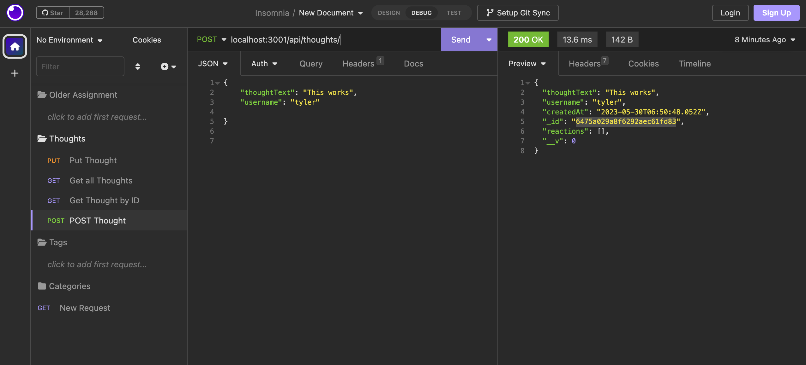
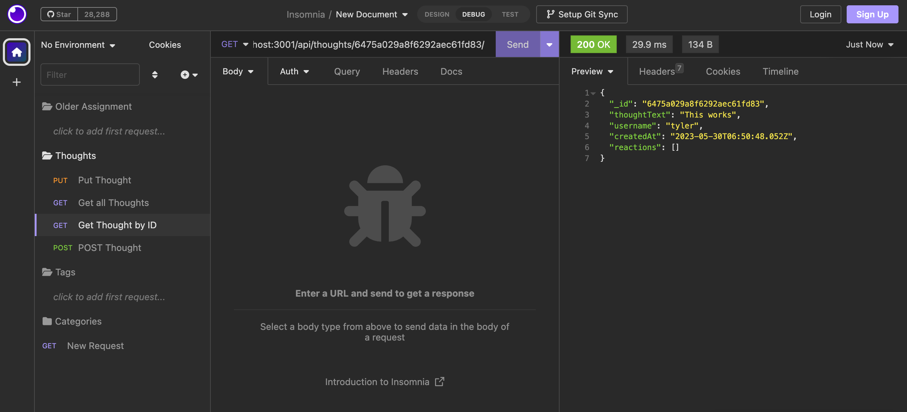
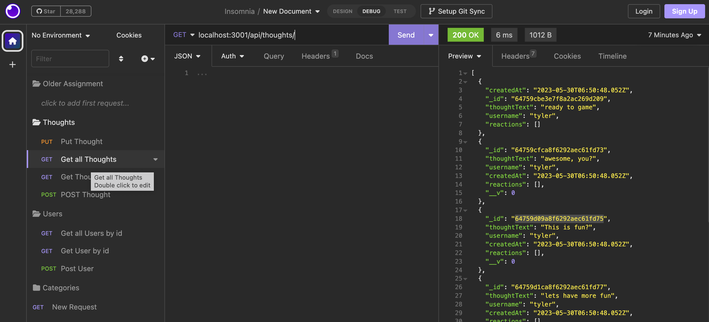
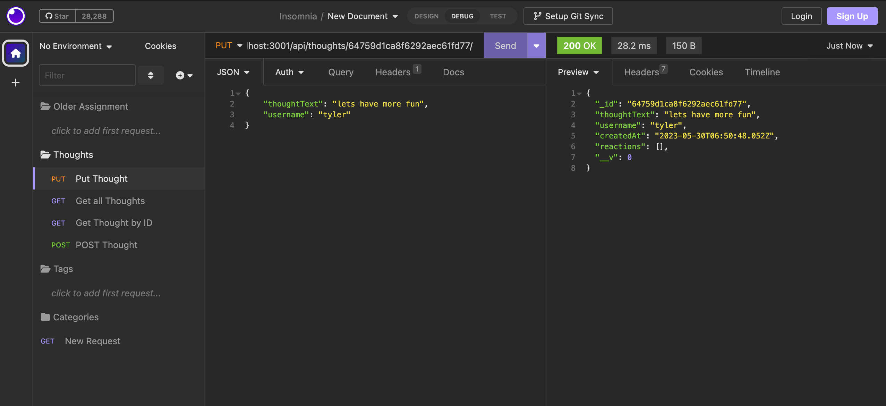
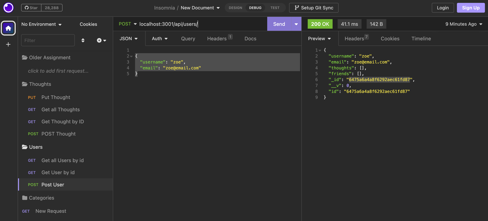
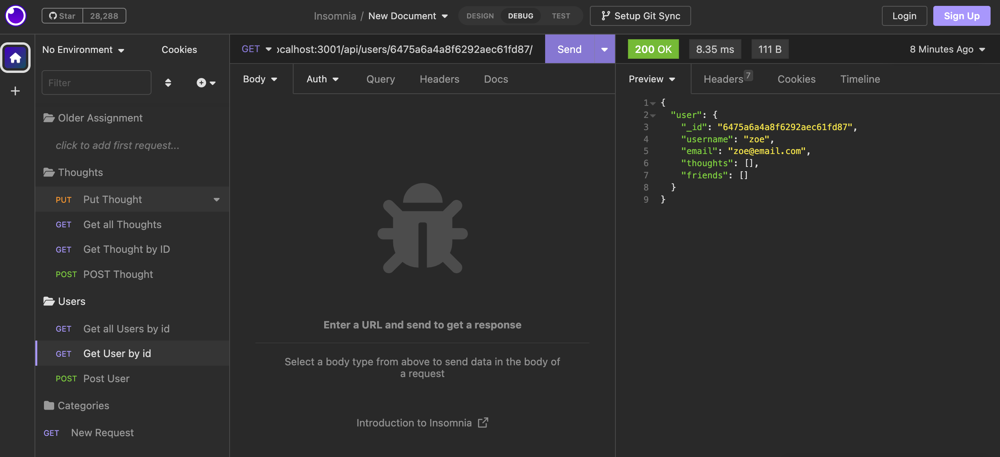
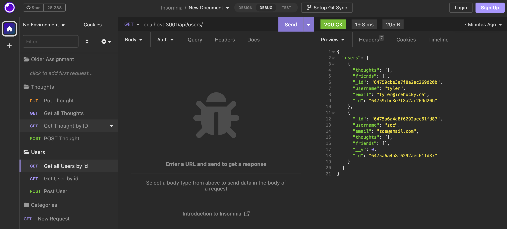

# social-network-api

## Concept/Description
A social network API where users can share their thoughts, react to friends' thoughts, and create a friend list.

## User Story

* AS A social media startup
* I WANT an API for my social network that uses a NoSQL database
* SO THAT my website can handle large amounts of unstructured data

## Problems Solved

An API capable of created, updating, reacting, and deleting thoughts, reactions and users. This is solved by meeting the following acceptance criteria:

* GIVEN a social network API
* WHEN I enter the command to invoke the application
* THEN my server is started and the Mongoose models are synced to the MongoDB database
* WHEN I open API GET routes in Insomnia for users and thoughts
* THEN the data for each of these routes is displayed in a formatted JSON
* WHEN I test API POST, PUT, and DELETE routes in Insomnia
* THEN I am able to successfully create, update, and delete users and thoughts in my database
* WHEN I test API POST and DELETE routes in Insomnia
* T*HEN I am able to successfully create and delete reactions to thoughts and add and remove friends to a user’s friend list 

## Usage

The following images show some of the Insomnia routes. You can watch the walkthrough video by visiting here: (https://watch.screencastify.com/v/zDJIFeRMByNYym3z9Cy6)  

POST Thought:

GET Thought:

GET All Thoughts:

PUT Thought:

POST User

GET User

Get All User:

## Installation

`npm i`

`npm run seed`

`npm run start`

## License

MIT

